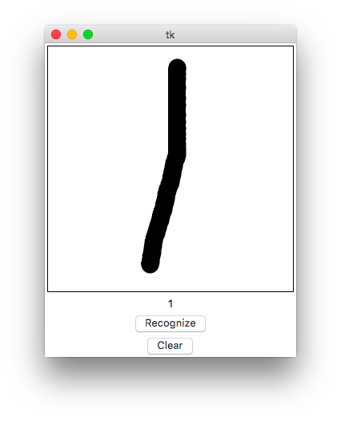
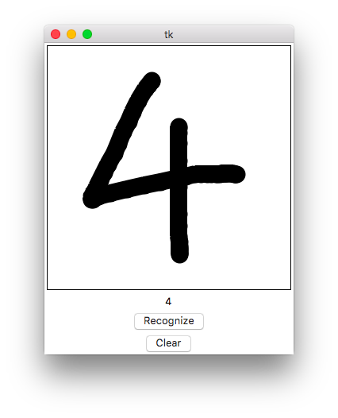
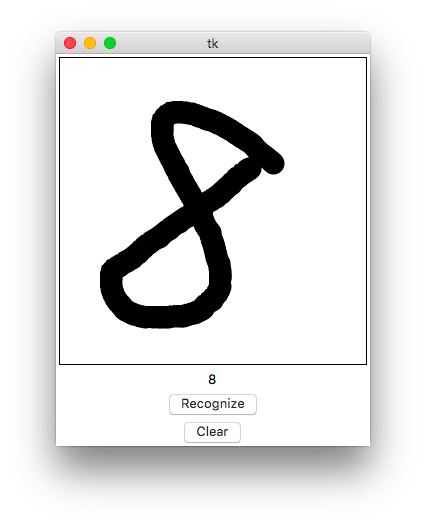

# DigitClassifier

多層パーセプトロンを使った手書き数字認識アプリケーション．

## 使い方

1. ウィンドウ上部のキャンバスにマウスを使って数字を書きます．   
2. ウィンドウ下部の"Recognize"ボタンを押します．   
3. キャンバスに書かれた数字が識別され，ラベルに結果が表示されます．   

## Demo

   
   
   

## Requirements

python >= 3.5.1   
pillow >= 3.2.0   
numpy >= 1.11.0
